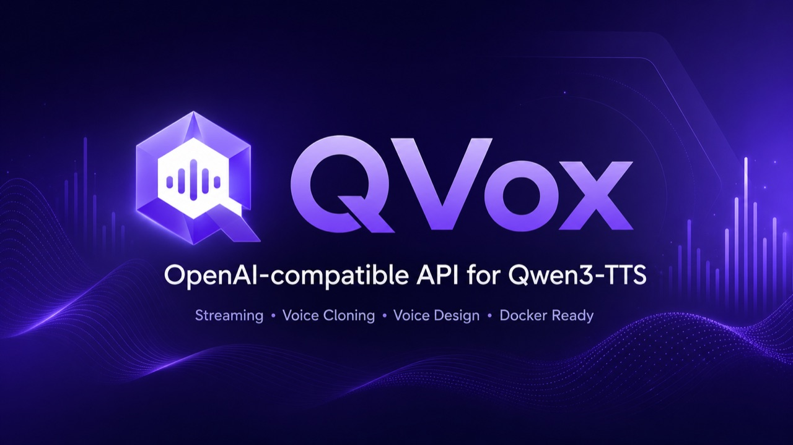

<p align="center">
  
</p>

# qwen3-tts-api · `qvox`

A **local** TTS server/daemon powered by **Qwen3-TTS**, with an **HTTP API** (OpenAI-style),
a **web panel**, a **CLI**, and **cloneable voices**. Runs on `localhost` (Mac) or exposed on the
network (`0.0.0.0`, VPS) with an optional **API key**. No database: everything is file-configured.

> The command is **`qvox`**. The name lives in a single constant (`src/brand.js`) — change it
> there and it propagates to the command, data folder (`~/.qvox`), env vars and panel.

## Install

```bash
npm install -g qwen3-tts-api      # installs the `qvox` command
qvox setup                        # creates config + folders, checks deps
qvox serve                        # starts API + panel at http://127.0.0.1:5111
```

Requirements: **Node ≥ 18** and **[uv](https://docs.astral.sh/uv/)** (manages Python/models on its own).
`ffmpeg` optional (audio conversion).

## Quick usage

```bash
qvox speak "Hi there, how are you?" --voice aiden --out demo.wav
qvox speak "Hello" --clone /path/to/voice.wav --out clone.wav   # clone a voice
qvox serve --host 0.0.0.0 --port 5111                           # expose on the network
qvox config set apiKey my-key                                   # protect with an api key
qvox models list
qvox status
```

## Backends (auto-detected)

| Platform | Backend | Notes |
|---|---|---|
| Mac (Apple Silicon) | **mlx** | Fast (~0.85x real-time). Cloning not supported yet (mlx-audio bug). |
| NVIDIA / ROCm / CPU | **torch** | Universal, **supports cloning**. Slower on MPS. |

Force it: `qvox config set engine.backend torch`.

## API (OpenAI-compatible)

```bash
curl -X POST http://127.0.0.1:5111/v1/audio/speech \
  -H "content-type: application/json" \
  -H "x-api-key: YOUR_KEY" \
  -d '{"input":"Hello world","language":"English","instruct":"A warm voice"}' \
  -o out.wav
```

### Streaming

`/v1/audio/speech` cannot answer until the last sample exists. `/v1/audio/speech/stream`
sends the audio as it is generated — raw 16-bit little-endian mono PCM, chunked, with the
sample rate in `X-QVox-Sample-Rate`:

```bash
curl -N -X POST http://127.0.0.1:5111/v1/audio/speech/stream \
  -H "content-type: application/json" \
  -H "x-api-key: YOUR_KEY" \
  -d '{"input":"Hola, ¿cómo va?","language":"Spanish","voice":"aiden"}' \
  --output - | ffplay -f s16le -ar 24000 -ac 1 -i - -nodisp -autoexit
```

Same 77-character line, same model, same machine: **3.5 s** to a complete WAV, **~0.4 s**
to the first streamed chunk. The waiting was never the audio, it was waiting for all of
it. Quality is unchanged — the chunks joined transcribe back word for word, because the
decoder carries 25 frames of left context across the seams. MLX backend only.

See [docs/API.md](docs/API.md), [docs/CLI.md](docs/CLI.md), [docs/ARCHITECTURE.md](docs/ARCHITECTURE.md).

## Agent skill (integrate it elsewhere)

`skills/qvox-tts/` is a Claude Code skill that teaches an agent how to call this API and use the
inline `[emotion]` tags when building **other** apps. Install it with
`cp -r skills/qvox-tts ~/.claude/skills/`. The portable tag reference
([skills/qvox-tts/references/emotion-tags.md](skills/qvox-tts/references/emotion-tags.md)) is
self-contained — paste it into any prompt or LLM context.

## License
MIT · tecnomanu. Qwen3-TTS models: Apache-2.0 (Alibaba).
